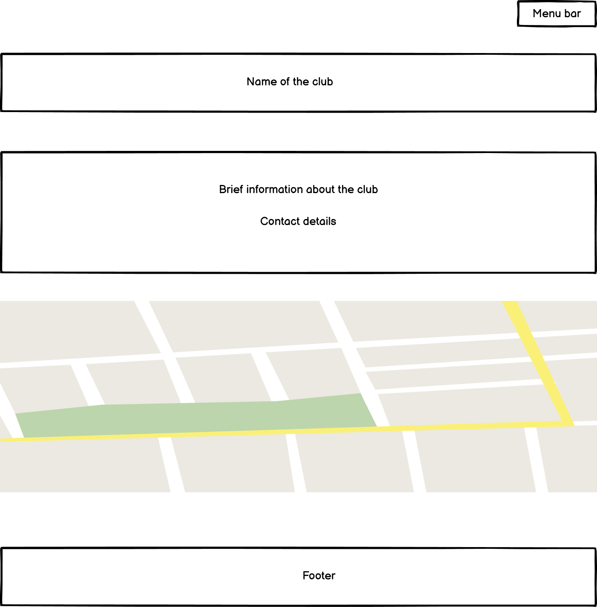
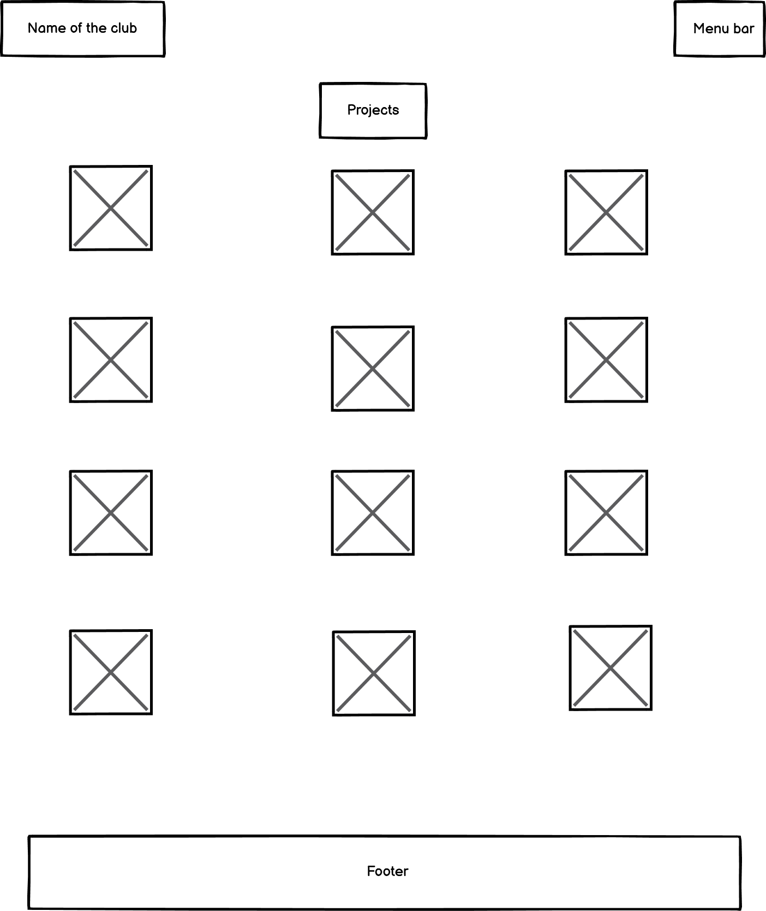
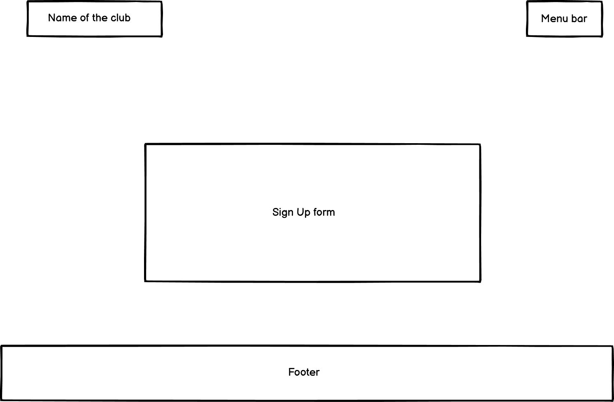
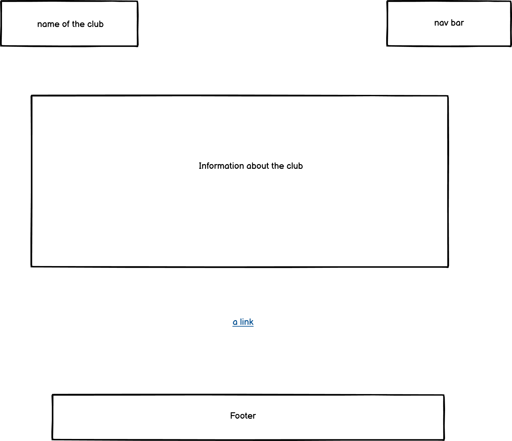
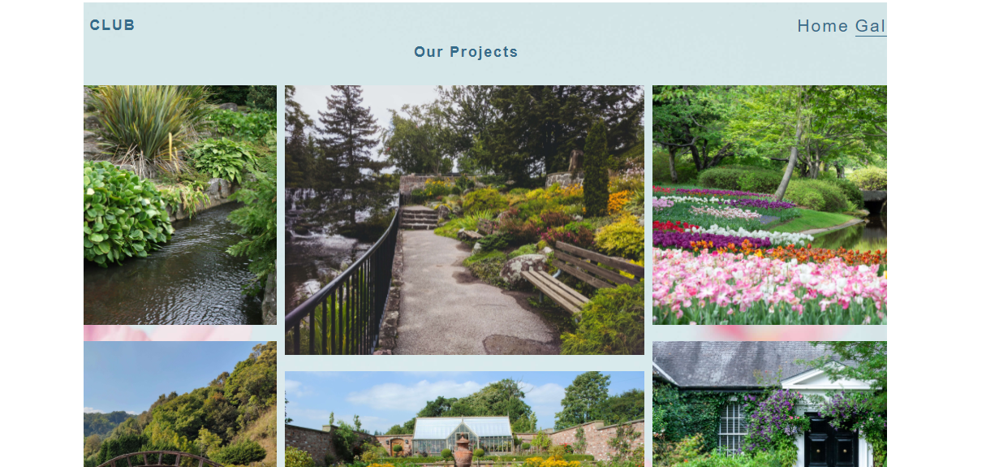
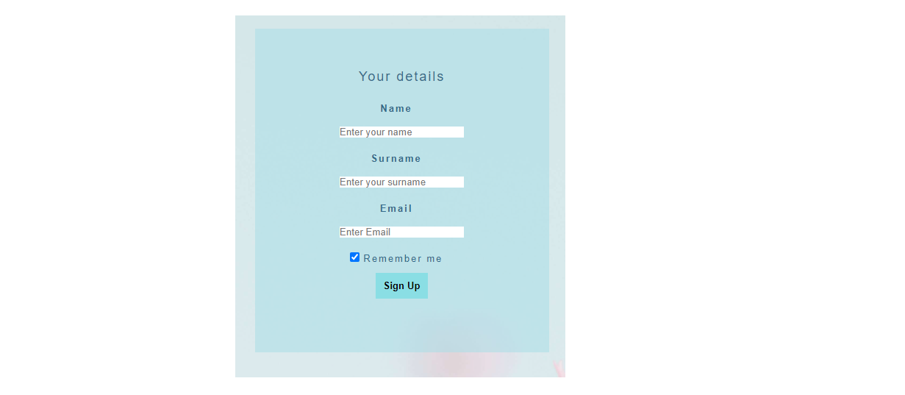
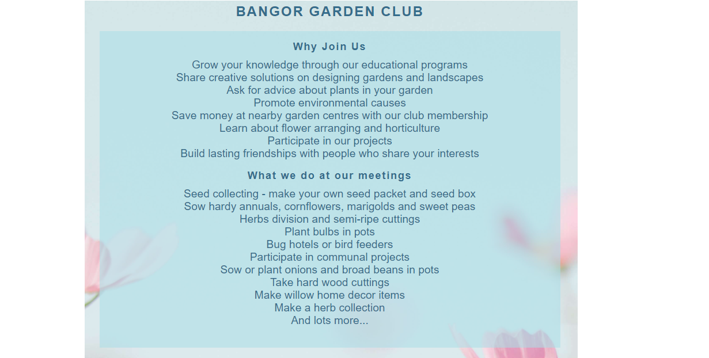

# Bangor Garden Club

Bangor Garden Club is a site that aims to promote environmental causes and motivate people to learn from experienced gardeners as well as share own knowledge, ideas and know-how with new generations of gardeners. The site will be targeted towards people who love gardening and look for a way to socialise.
Bangor Garden Club will be useful for gardeners who want to join the club in order to participate in projects, share their ideas and knowledge with others.

# User Stories

**Client Goals**
- To be able to view the site on a range of device sizes.
- To make it easy for potential members to find out what the garden club is and how to join it.
- To allow people to be able to contact the garden club to ask further questions.

**First Time Visitor Goals**
- I want to find out what Bangor Garden Club is and how I can join it.
- I want to be able to navigate the site easily to find information.
- I want to be able to find their social media profiles.

**Returning Visitor Goals**
- I want to find information on what the  current projects are and what educational programs are available .
- I want to be able to see the dates for upcomming meetings of the club members.

**Frequent Visitor Goals**
I want to be able to give and ask advice on plants care in blogs.

## Design 
The image from https://unsplash.com/ was set as the background for all of the pages.
The cover-text uses rgba(171, 222, 231, 0.568)

## Typography
Font-family " Libre Franklin, Arial, Helvetica" was used throughout the website.

## Imagery
The images were used from https://unsplash.com/. 

## Wireframes
Wireframes were created for mobile, tablet and desktop.

index.html

gallery.html 

signup.html 

learnmore.html

## Features
The website is comprised of four pages, Home, Gallery and Signup Pages are accessible from the navigation menu (home page, gallery page and signup page). Signup page is also accessible from the clickable link that is present in Learnmore page for the user's convenience.

**Home, Gallery and Signup Pages on the website have:**

__Navigation Bar__

- Featured on all three pages, the full responsive navigation bar includes links to the Home page, Gallery and Sign Up page and is identical in each page to allow for easy navigation and maintain consistency throughout the site.
- This section will allow the user to easily navigate from page to page across all devices without having to revert back to the previous page via the ‘back’ button. 

 !!!!!!!!!!!!

__Footer__

- A footer which contains social media icon links to facebook, instagram and twitter. Icons were used to keep the footer clean also they are universally recognisable. The links will open to a new tab to allow easy navigation for the user. The footer is useful to the user as it is a form of encouragement for them to keep connected via social media.

! !!!!!!!!

**Home Page**

- __The landing page__

Club's name is at the top of the page to draw the user's attention. Section containing brief information about the club with its contact details, address and meeting times is below the club's name. The same section contains a clickable link that opens in a new tab if the users want to learn more about the club.

- __Map section__

  This section shows the users the location of the community centre where the classes take place. 
Map section goes below section with clubs' information. It shows the users the location of the club.

**Gallery page**

Gallery will provide the user with supporting images to see what the club does and its members' accomplishments.

**Signup page**

This page will allow the user to get signed up to the club's meetups by submitting their full name and email address.

**Learn more page**

This page will provide more information about the club and will allow the user to see the benefits of joining the club. This user will see the value of signing up for the club's meetups. 

**Features left to implement**
- Separate page to be added which will comprise of blocks of information about ecology meetings and programs to engage cildren and teens.
- Separate page for the members to view club members' events and blogs.
- Exchange/Giveaway page - This page would enable club's members to see the information about plants exchange and giveaways events that take place in the club. 

## Accessibility
Descriptive alt attributes were used on images, a sufficient colour contrast was observed throughout the site and menus are accessible by marking the current page as current for screen readers.

# Technologies Used

The following technologies were used to create and test the website:
- HTML - HyperText Markup Language to create the structure of the website content.
- CSS - Cascading Style Sheet Language to provide style to the website.
- Balsamiq to create wireframes.
- TinyPNG - to compress images.
- Gitpod - to create cloud based Integrated Developement Environment.
- GitHub - to provide software development to store files.
- Git - to do version control system.
- Google Dev Tools - To troubleshoot and test features, resolve issues with responsiveness and styling.
- Favicon.io - to create Favicon.
- Font Awesome - For the iconography on the website.
- Am I Responsive? - to show the website landing page responsiveness on different devices.
- README Markdownguide - to use tips for creation of README.md
- CSS Jigsaw - to validate CSS code.
- HTML Vallidator - to validate HTML code.
- LiveBrowserStack - to check the compatability of website.
- Freeformatter - to validate HTML code.

# Deployment & Local Development
## Deployment
Github Pages was used to deploy the live website. The instructions to achieve this are below:

1. Log in (or sign up) to Github.
2. Find the repository for this project.
3. Click on the Settings link.
4. Click on the Pages link in the left hand side navigation bar.
5. In the Source section, choose main from the drop down select branch menu. Select Root from the drop down select folder menu.
6. Click Save. Your live Github Pages site is now deployed at the URL shown.

## Local Development
**How to Fork**
To fork the .... repository:

1. Log in (or sign up) to Github.
2. Go to the repository for this project, .....
3. Click the Fork button in the top right corner.

**How to Clone**
To clone the ..... repository:

1. Log in (or sign up) to GitHub.
2. Go to the repository for this project, kera-cudmore/Bully-Book-Club.
3. Click on the code button, select whether you would like to clone with HTTPS, SSH or GitHub CLI and copy the link shown.
4. Open the terminal in your code editor and change the current working directory to the location you want to use for the cloned directory.
5. Type 'git clone' into the terminal and then paste the link you copied in step 3. Press enter.

## Testing

To view all testing documentation please refer to [TESTING.md](TESTING.md)

In addition, you should mention in this section how your project looks and works on different browsers and screen sizes.

You should also mention in this section any interesting bugs or problems you discovered during your testing, even if you haven't addressed them yet.

If this section grows too long, you may want to split it off into a separate file and link to it from here.

### Validator Testing 

- HTML
  - No errors were returned when passing through the official [W3C validator](https://validator.w3.org/nu/?doc=https%3A%2F%2Fcode-institute-org.github.io%2Flove-running-2.0%2Findex.html)
- CSS
  - No errors were found when passing through the official [(Jigsaw) validator](https://jigsaw.w3.org/css-validator/validator?uri=https%3A%2F%2Fvalidator.w3.org%2Fnu%2F%3Fdoc%3Dhttps%253A%252F%252Fcode-institute-org.github.io%252Flove-running-2.0%252Findex.html&profile=css3svg&usermedium=all&warning=1&vextwarning=&lang=en#css)

### Unfixed Bugs

You will need to mention unfixed bugs and why they were not fixed. This section should include shortcomings of the frameworks or technologies used. Although time can be a big variable to consider, paucity of time and difficulty understanding implementation is not a valid reason to leave bugs unfixed. 

## Deployment

This section should describe the process you went through to deploy the project to a hosting platform (e.g. GitHub) 

- The site was deployed to GitHub pages. The steps to deploy are as follows: 
  - In the GitHub repository, navigate to the Settings tab 
  - From the source section drop-down menu, select the Master Branch
  - Once the master branch has been selected, the page will be automatically refreshed with a detailed ribbon display to indicate the successful deployment. 

The live link can be found here - https://code-institute-org.github.io/love-running-2.0/index.html 

## Credits 

In this section you need to reference where you got your content, media and extra help from. It is common practice to use code from other repositories and tutorials, however, it is important to be very specific about these sources to avoid plagiarism. 

You can break the credits section up into Content and Media, depending on what you have included in your project. 

### Content 

- The text for the Home page was taken from Wikipedia Article A
- Instructions on how to implement form validation on the Sign Up page was taken from [Specific YouTube Tutorial](https://www.youtube.com/)
- The icons in the footer were taken from [Font Awesome](https://fontawesome.com/)

### Media

- The photos used on the home and sign up page are from This Open Source site
- The images used for the gallery page were taken from this other open source site

Congratulations on completing your Readme, you have made another big stride in the direction of being a developer! 

## Other General Project Advice

Below you will find a couple of extra tips that may be helpful when completing your project. Remember that each of these projects will become part of your final portfolio so it’s important to allow enough time to showcase your best work! 

- One of the most basic elements of keeping a healthy commit history is with the commit message. When getting started with your project, read through [this article](https://chris.beams.io/posts/git-commit/) by Chris Beams on How to Write  a Git Commit Message 
  - Make sure to keep the messages in the imperative mood 

- When naming the files in your project directory, make sure to consider meaningful naming of files, point to specific names and sections of content.
  - For example, instead of naming an image used ‘image1.png’ consider naming it ‘landing_page_img.png’. This will ensure that there are clear file paths kept. 

- Do some extra research on good and bad coding practices, there are a handful of useful articles to read, consider reviewing the following list when getting started:
  - [Writing Your Best Code](https://learn.shayhowe.com/html-css/writing-your-best-code/)
  - [HTML & CSS Coding Best Practices](https://medium.com/@inceptiondj.info/html-css-coding-best-practice-fadb9870a00f)
  - [Google HTML/CSS Style Guide](https://google.github.io/styleguide/htmlcssguide.html#General)

Getting started with your Portfolio Projects can be daunting, planning your project can make it a lot easier to tackle, take small steps to reach the final outcome and enjoy the process! 