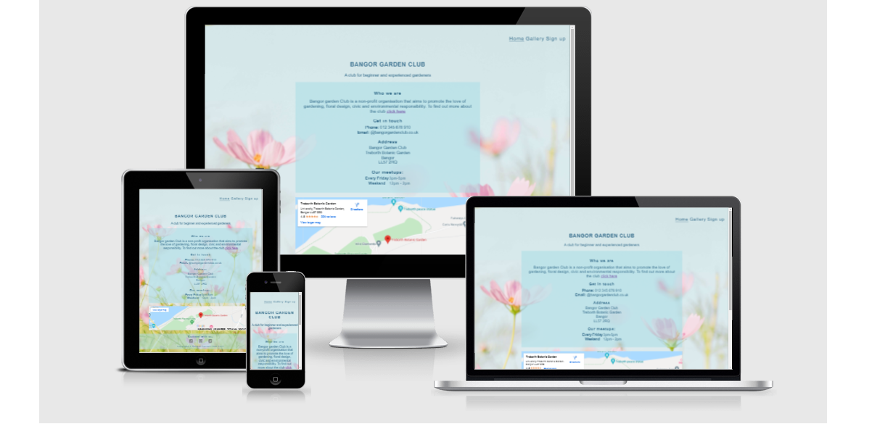
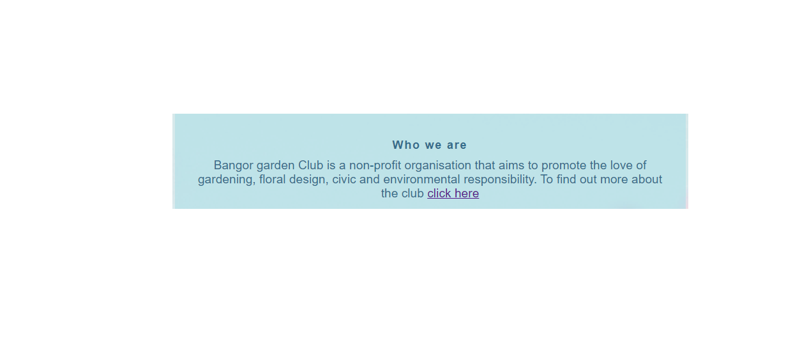

# Bangor Garden Club

Bangor Garden Club is a site that aims to promote environmental causes and motivate people to learn from experienced gardeners as well as share their knowledge, ideas and know-how with new generations of gardeners. The site will be targeted towards people who love gardening and look for ways to socialise.
Bangor Garden Club will be useful for gardeners who want to join the club in order to participate in projects, share their ideas and knowledge with others.

 
[View Bangor Garden Club](https://olena1788.github.io/first-project/)

# User Stories

**Client Goals**
- To be able to view the site on a range of device sizes.
- To make it easy for potential members to find out what the garden club is and how to join it.
- To allow people to be able to contact the garden club to ask further questions.

**First Time Visitor Goals**
- I want to find out what Bangor Garden Club is, the benefits of joining it and activities that take place at meetups.
- I want to be able to navigate the site easily to find information.
- I want to be able to find their social media profiles.

**Returning Visitor Goals**
- I want to be able to sign up for the club's meetups.

## Design 
The image from https://unsplash.com/ was set as the background for all of the pages.

## Typography
Font-family " Libre Franklin, Arial, Helvetica" was used throughout the website.

## Imagery
The images were used from https://unsplash.com/ 

## Wireframes

index.html


gallery.html 


signup.html 


learnmore.html


## Features
The website is comprised of four pages, all of them are accessible from the navigation menu. Signup page is also accessible from the clickable link which is present in Learn more page for the user's convenience.

**All pages on the website have:**

__Navigation Bar__

- Featured on all four pages, the full responsive navigation bar includes links to the Home, Gallery, Learn more and Sign Up pages and is identical in each page to allow for easy navigation and maintain consistency throughout the site.
- This section will allow the user to easily navigate from page to page across all devices without having to revert back to the previous page via the ‘back’ button. 

 

__Footer__

- The footer contains social media icon links to Facebook, Instagram and Twitter icons which were used to keep the footer clean, they are also they are universally recognisable. The links will open to a new tab to allow easy navigation for the user. The footer is useful to the user as it is a form of encouragement for them to keep connected via social media.

 

**Home Page**

- __The landing page__

The club's name is at the top of the page to draw the user's attention. Section containing brief information about the club with its contact details, address and meeting times is below the club's name. The same section contains a clickable link which opens in a new tab if the user wants to find out more about the club.


- __Map section__

Map goes below the section with the information about the club. It shows the user the location of the club.


**Gallery page**

Gallery will provide the user with supporting images to see what the club does and its members' accomplishments.                             


**Signup page**

This page will allow the user to get signed up to the club's meetups by submitting their full name and email address.


**Learn more page**

This page will provide more information about the club and will allow the user to see the benefits of joining the club. The user will see the value of signing up for the club's meetups. 


**Features left to implement**
- Separate page to be added which will comprise of blocks of information about ecology meetings and programms to engage children and teens.
- Separate page for the members to view club members' events and blogs.
- Exchange/Giveaway page - This page would enable club's members to see the information about plants exchange and giveaways events which take place in the club. 

## Accessibility
Descriptive alt attributes were used on images and social media links, a sufficient colour contrast was observed throughout the site and menus are accessible by marking the current page as current for screen readers.

# Technologies Used

The following technologies were used to create and test the website:
- HTML - HyperText Markup Language to create the structure of the website content.
- CSS - Cascading Style Sheet Language to provide style to the website.
- Balsamiq to create wireframes.
- TinyPNG - to compress images.
- Gitpod - to create cloud based Integrated Developement Environment.
- GitHub - to provide software development to store files.
- Git - to do version control system.
- Google Dev Tools - To troubleshoot and test features, resolve issues with responsiveness and styling.
- Font Awesome - For the iconography on the website.
- Am I Responsive? - to show the website landing page responsiveness on different devices.
- README Markdownguide - to use tips for creation of README.md
- CSS Jigsaw - to validate CSS code.
- HTML Vallidator - to validate HTML code.
- wave.webaim - to evaluate website accessibility.
- [Favicon.io](https://favicon.io/) - to create Favicon.
- LiveBrowserStack - to check the compatability of website.
- Freeformatter - to validate HTML code.

# Deployment & Local Development
## Deployment

- The site was deployed to GitHub pages. The steps to deploy are as follows: 
  - In the GitHub repository, navigate to the Settings tab 
  - From the source section drop-down menu, select the Main Branch, then click "Save".
  - Once the Main branch has been selected, the page will be automatically refreshed with a detailed ribbon display to indicate the successful deployment. 

The live link can be found [here](https://olena1788.github.io/first-project/)

### Local Deployment

In order to make a local copy of this project, you can clone it. In your IDE Terminal, type the following command to clone my repository:

- `git clone https://github.com/Olena1788/first-project/.git`  

Alternatively, if using Gitpod, you can click below to create your own workspace using this repository.

[](https://gitpod.io/#https://github.com/Olena1788/first-project/)

## Testing

To view all testing documentation please refer to [TESTING.md](TESTING.md)

### Testing User Stories

First Time Visitors
- I want to find out what Bangor Garden Club is, the benefits of joining it and what activities take place at meetups.


- I want to be able to navigate the site easily to find information.

- I want to be able to find their social media profiles.


**Returning Visitor Goals**
- I want to be able to sign up for the club's meetups.


## Credits 

### Content 

- The content for the website was invented.

- The icons in the footer were taken from [Font Awesome](https://fontawesome.com/)

- Part of the code borrowed from [w3schools](https://www.w3schools.com/css/css3_flexbox_responsive.asp)

```css

/* For small screens sizes from 600px wide and down */
@media screen and (max-width: 600px){
    .flex-container {
    flex-direction: column;
  }
}
```

- Part of the code was copied from Love Running to style images: 

- Media query was copied from Love Running:

```css

/* For small screens sizes from 800px wide and down */
@media screen and (max-width: 800px){
    #img {
        column-count: 2;
    }
}
```
Copied from Code Institute for the Contact page:

```html

 <form action="https://formdump.codeinstitute.net" method="POST">
   ```

- Love Running README boilerplate was partially used for README.md

### Media

- The photo used as a background on all of the pages is taken from [Unsplash](https://unsplash.com/photos/0lL6Sox7n1Y).

- The images used for the Gallery page are taken from [Unsplash](https://unsplash.com/)

### Acknowledgements

I would like to acknowledge the following people in helping me to create the website:

1. Helen Denning, a student at Code Institute, for guidance and help throughout the project.
2. All the people in slack who took time to reply to the questions I had.
3. Daisy McGirr, my mentor, for guidance and help throughout the project.


 


