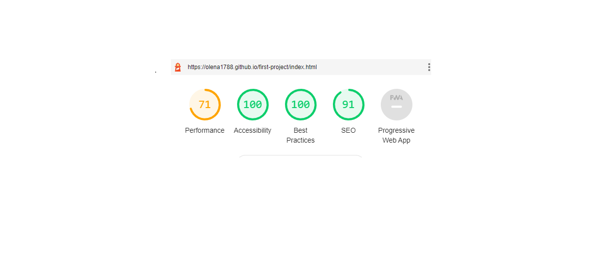
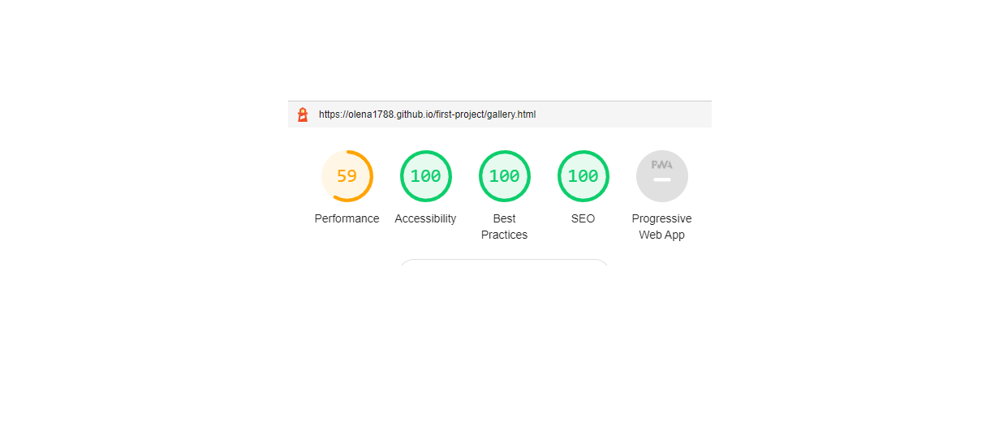
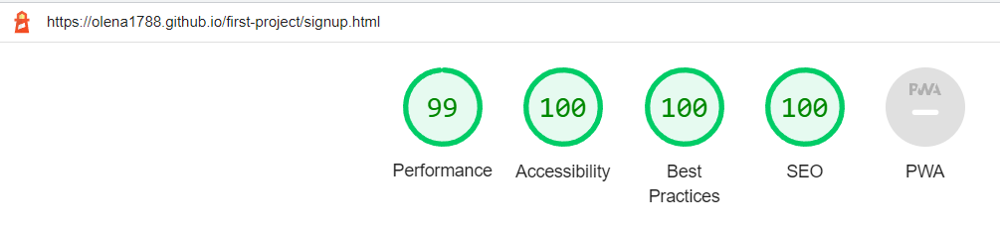
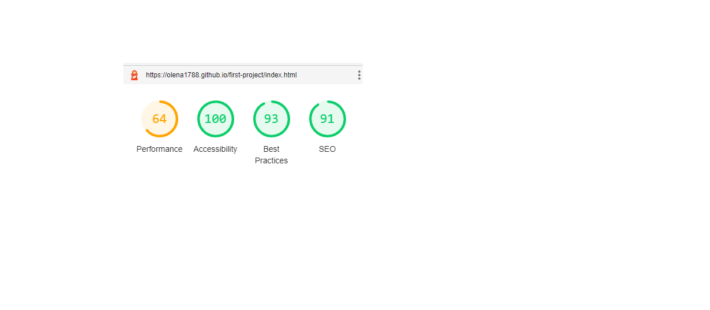
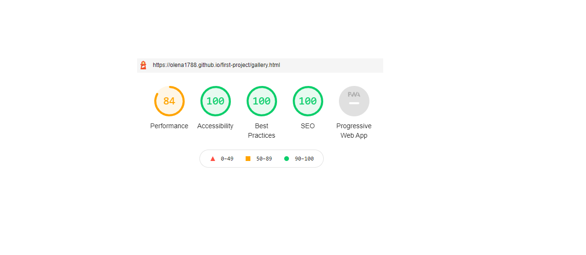
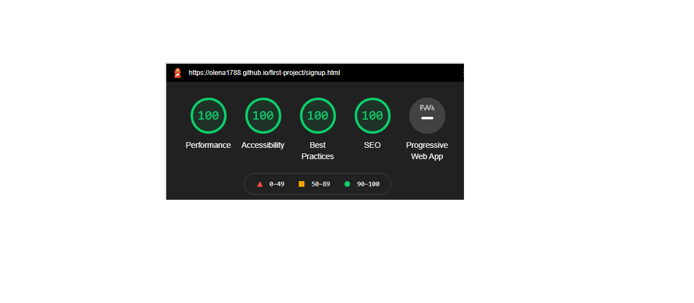

# Testing

Testing was ongoing throughout the entire process. 

The following tests were conducted to determine the site works well. 

## Validator Testing 

### W3C Validator

The [W3C validator](https://validator.w3.org/) was used to validate the HTML on all four pages of the website. No errors or warnings were found on html pages.

The [Jigsaw W3](https://jigsaw.w3.org/css-validator/) was used to validate CSS code. All the  errors on CSS validation were related to [Font awesome](https://fontawesome.com/v6.0/icons).

- [Home Page HTML](documentation/testing/home-page-validation.png)
- [Gallery Page HTML](documentation/testing/gallery-page-validation.png)
- [Sign up Page HTML](documentation/testing/form-page-validation.png)
- [CSS](documentation/testing/css-validation-home.png)

### Lighthouse Results

Report for home page (desktop): 

- Links (learn more) do not have descriptive text;
- Links do not have a discernible name (social meadia links).
- Does not use passive listeners to improve scrolling performance.
- Serve static assets with an efficient cache policy.
- -Links to cross-origin destinations are unsafe.

Report for gallery page (desktop):

- Properly size images;
- Links do not have a discernible name (social meadia links).

Report for signup page (desktop):
- Links do not have a discernible name (social meadia links).

report for learnmore (desktop):
- Links do not have a discernible name (social meadia links).


#### Mobile Devices





#### Desktop






## Unfixed Bugs

### The Lighthouse Results

- The Lighthouse results of the Performance score on the Gallery page for the desktops in Chrome are not consistent. I have included the best results. Sometimes the Performance results shows low score. The problem is the size of the images which were already compressed several times. 

- To further improve the score of the Performance on the Lighthouse for the Gallery page on desktops a link was added in the head of html which seemed to have helped at first but then different low results were shown again. 

```html
<link rel="preload" as="style" href="assets/css/style.css"> 
```

### Browser Compatability Bugs

The only problem with the browser compatability I have noticed is the Contact page on Yandex: the form is too wide.


## Responsiveness

### On the Mobile


### On the Tablet


### On the Desktop


## Browser Compatability

### Safari


### Opera


### Firefox


### Yandex


### Edge


