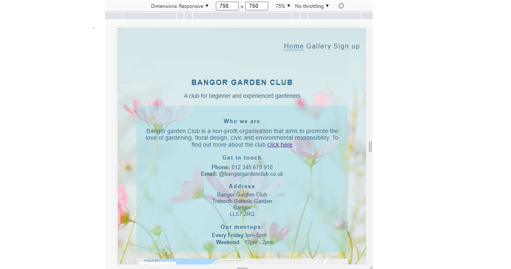

# Testing

Testing was ongoing throughout the entire process. 

To fully test my website I performed the following testing using a number of browsers (google chrome, safari, mozilla firefox) and devices.

I also went through each page using google chrome developer tools to ensure that they responsive on all different screen sizes.

Links.

1. Test each link in the index page. Each link worked as expected, and any links leading to external pages opened correctly in a seperate browser tab.
2. Test each link in the learnmore page. Each link worked as expected, and any links leading to external pages opened correctly in a seperate browser tab.
3. Test each link in the gallery page. Each link worked as expected, and any links leading to external pages opened correctly in a seperate browser tab.
4. Test each link in the signup page. Each link worked as expected, and any links leading to external pages opened correctly in a seperate browser tab.

Sign up Form.

1. Test the sign up form. I tried to submit the form without filling in any input fields. The form worked correctly and directed users to fill in the name field. I then filled in the name field and tried to submit the form. Again the form worked correctly and directed the user to fill out the surname field. I filled out the surnamename field and tried to submit the form. Again the form worked correctly and directed the user to fill out the email form. I filled out the email field and tried to submit the form. The form worked correctly.
2. I tried to submit the form with only an email address - the form directed the user to fill in the name field. I filled out the name and email fields and tried to submit the form. The form then directs the user to fill out the surname field. I filled in the name, email and surname field and was able to submit the form.
3. I tried to submit the form with only the surname - the form directed the user to fill in the name field. I filled out the name and surname fields and tried to submit the form. The form then directed the user to fill out the email field. I filled in the name, email and surname field and was able to submit the form.

5. I selected the checkbox "Remember me" without filling any fields and tried to submit the form. The form directed me to fill in the name field. I filled in the name field and the form directed me to fill in the surname field. I filled in the name and surname fields and tried to submit the form. The form directed the user to fill in the email field. Once I filled in the name, surname and email fields with a checkbox selected I was then able to submit the form.
6. I tried submitting the form without any information filled in. The form directed me to fill in the name field. It then went on to ask me to complete the surname and email fields if they are not filled out. The form can then be submitted.

- - -

Also the following tests were conducted to determine the site works well. 

## Validator Testing 

### W3C Validator

The [W3C validator](https://validator.w3.org/) was used to validate the HTML on all four pages of the website. No errors or warnings were found on html pages.

The [Jigsaw W3](https://jigsaw.w3.org/css-validator/) was used to validate CSS code. No errors were found on css page.

- [Home Page HTML](documentation/testing/home-page-validation.png)
- [Gallery Page HTML](documentation/testing/gallery-page-validation.png)
- [Sign up Page HTML](documentation/testing/form-page-validation.png)
- [Learn more Page HTML](documentation/testing/learnmore-page-validation.png)
- [CSS](documentation/testing/css-validation.png)

### Lighthouse Results

#### Mobile Devices

#### Desktop

## Fixed Bugs (Lighthouse report suggestions):

- Links do not have a discernible name. I used the aria-label attribute to eliminate the error.
- Links to cross-origin destinations are unsafe. I added rel="noopener" to avoid this issue.

## Unfixed Bugs (Lighthouse report suggestions):

- Does not use passive listeners to improve scrolling performance.
- Serve static assets with an efficient cache policy.
- Properly size images (Images in gallery page have been compressed several times which slightly improved performance). Lighthouse report on performance for all of the pages is not consistent. Sometimes Performance results show very low scores.
- Serve images in next-gen formats (Converted images to WebP at one point but performance did not improve and on the contrary consistently showed lower scores than before so I had them back to png format) 

## Responsiveness

### On the Mobile

### On the Tablet

### On the Desktop

## Browser Compatability

### Firefox

### Yandex

### Edge

